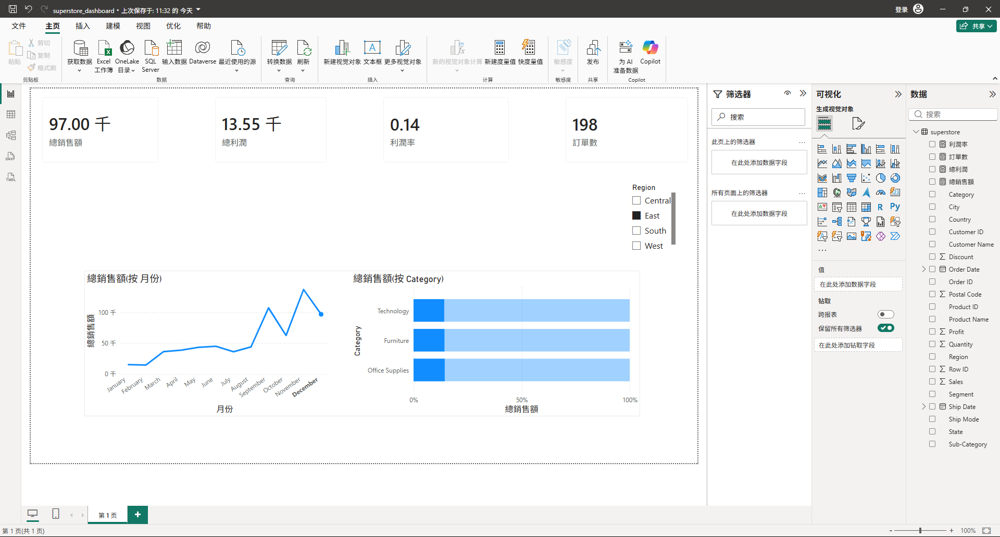

# Superstore 電商營運分析

電商銷售資料的探索性分析專案，使用 Python 與 Power BI 分別實作互動式 Dashboard，並部署至雲端。

## Live Demo
[Streamlit Dashboard](https://superstore-eda-dashboard-5zahahqvkuzw7nhcs72tqo.streamlit.app/)

## 使用技術

| 工具 | 用途 |
|------|------|
| Python / pandas | 資料清理與前處理 |
| SQL (SQLite) | 資料聚合查詢 |
| Plotly / Streamlit | 互動式視覺化與雲端部署 |
| Power BI | 商業報表與 DAX 量值 |

## 分析內容

- 月度銷售與利潤趨勢
- 品類與子品類利潤率比較
- 折扣率對利潤的影響分析
- 地區銷售表現

## Power BI Dashboard



## 主要發現

- 折扣超過 40% 的訂單平均利潤率為負，高折扣策略侵蝕獲利
- Technology 品類銷售額最高，但 Tables 子品類長期虧損
- Q4 銷售額較其他季度高出約 30%，季節性明顯

## 專案結構

```
superstore-eda-dashboard/
├── data/
│   └── superstore.csv
├── notebooks/
│   └── 01_eda.ipynb
├── scripts/
│   └── dashboard.py
├── screenshots/
│   └── dashboard_overview.png
├── superstore_dashboard.pbix
└── requirements.txt
```

## 資料來源

[Kaggle - Superstore Dataset](https://www.kaggle.com/datasets/vivek468/superstore-dataset-final)
